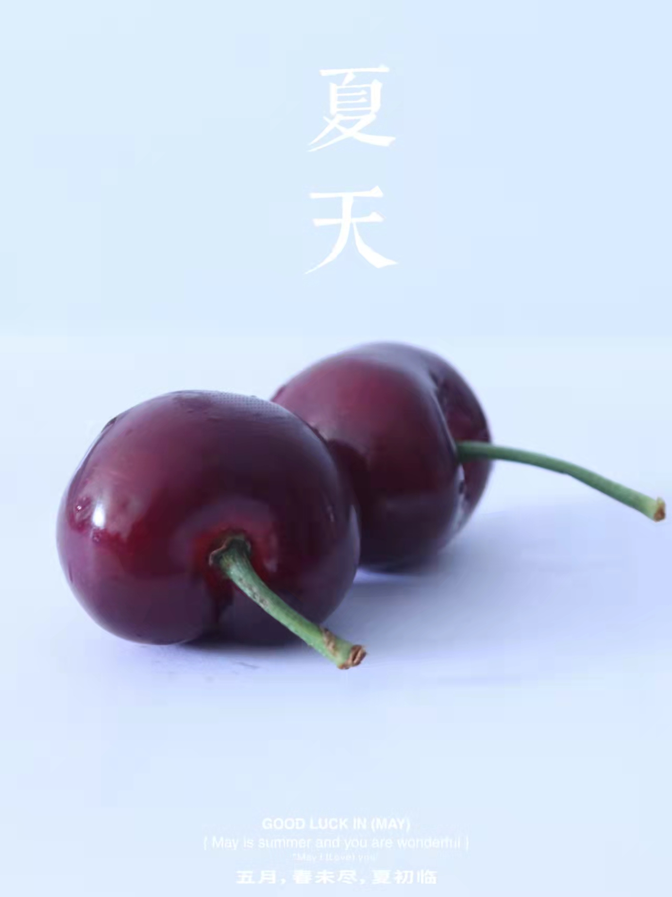

# 摄影构图法

## 1、水平线构图

水平线构图能使画面向左右方向产生视觉延伸感，增加画面的视觉张力，给人以宽阔、宁静、稳定之感。在拍摄时可根据实际拍摄对象的具体情况安排和处理画面的水平线位置。

如果天空较为平淡，可将水平线安排在画面的上1/3处，着重表现画面下半部分的景象，例如有小舟划过、飞鸟掠过：游禽浮过的波光粼粼的水面，或有满山野花、嶙峋山石的地面等。

反之，如果天空中有变幻莫测，层次丰富，光影动人的云彩，可将画面的表现重点集中在天空，此时可调整画面中的水平线，将其放置在画面的下1/3处，从而使天空的面积在画面中比较大。

除此之外，摄影爱好者还可以将水平线放置在画面的中间位置，以均衡对称的画面形式展现开阔，宁静的画面效果，此时地面或水面与天空各占画面的一半。使用这样的构图形式时，要注意水平线上下方的景物最好具一定的对称性，从而使画面比较平衡。

## 2、垂直线构图

垂直线构图也是基本的构图方法之一，可以利用树木和瀑布等呈现的自然线条变成垂直线的构图。在想要表现画面的延伸感时使用此构图是非常有利的，同时要稍作改变，让连续垂直的线条在长度上有所不同，这样就会使画面增添更多的节奏感。

## 3、 斜线构图

斜线构图能使画面产生动感，并沿着斜线的两端产生视觉延伸，加强了画面的纵深感。另外，斜线构图打破了与画面边框相平行的均衡形式，与其产生势差，从而使斜线部分在画面中被突出和强调。

拍摄时，摄影师可以根据实际情况刻意将在视觉上需要被延伸或者被强调的拍摄对象处理称为画面中的斜线元素加以呈现。

## 4、s形构

S型构图能够利用画面结构的纵深关系形成s形，因此其弯转、屈伸所形成的线条变化，能使观者在视觉上感到趣味无穷。在风光摄影领域，常用于拍摄河流、蜿蜒的路径等题材，在视觉顺序上对观者的视线产生由近及远的引导。在人像摄影领域，常用于表现女性曼妙的身材，诱使观者按照s形顺序深入到画面中，给被拍摄对象增添圆润与柔滑的感觉，使画面充满动感和趣味性。

## 5、三角形构图

三角形构图是指由人物主体的形体或形体组合在画面中形成三角形。三角形构图是人像摄影中常用的一种构图方式，三角形构图是使画面均衡的有效方法，往往给人以平稳、大方、稳定的感觉。另外，还有一些延伸的三角构图，例如倒三角形构图，虚三角形构图和多个三角形叠加构图。不同的三角形构图给人的视觉感受也不尽相同。

## 6、透视牵引构图

透视牵引构图能将观者的视线及注意力有效的牵引，聚集在整个画面中的某个点或线上，形成一个视觉中心。它不仅对视线具有引导作用，而且，还可以大大增加画面的视觉延伸性，增加画面的空间感。

画面中相交的透视线条所成的角度越大，画面的视觉空间效果则越显著。因此在拍摄时，摄影师所选择的镜头、拍摄角度等都会对画面透视效果产生相应的影响，例如，镜头视角越广，越可以将前景尽可能多地纳入画面，从而加大画面最近处与最远处的差异对比，获得更大的画面空间深度。

## 7、三分法构图

三分法构图是比较稳定、自然的构图。把主体放在三分线上，可以引导视线更好的注意到主体和，

这种构图法则一直以来被各种风格的摄影师广泛地使用。

## 8、散点式构图

散点式构图就是以分散的点状形象构成画面，就像一些珍珠散落在银盘里，使整个画面中的景物既有聚又有散，既存在不同的形态，又统一在照片中的背景中。

最常见的拍摄题材，是用俯视的角度表现地面的牛羊马群，或草地上星罗棋布的花朵。

## 9、对称式构图

对称式构图是指画面中的两部分景物以某一根线为轴，在大小：形状：距离和排列能方面相互平衡、对等的一种构图形式。

现实生活中的许多事物具有对称的结构，如人体、宫殿、寺庙、鸟类和蝴蝶的翅膀等，因此摄影中的对称构图实际是生活美的再现。

使用对称构图拍摄的照片给人一种和谐，平静和秩序感。在拍摄那些本身对称的建筑或其他景物时常用，拍摄时超过采用正面拍摄角度，例如拍摄寺庙或者其他古代建筑，以展现其庄严雄伟的内部对称式结构。除了利用被拍摄对象自身的具有的对称结构进行构图外，也可以利用水面的倒影进行对称构图，这种手法在拍摄湖面或其他水面时常用。

## 10、框式构图

框式构图是指借助于被摄对象自身或者被摄对象周围的环境，在画面中制造出框形的构图样式，以利于将观者的视点“框”在主体上，使之得到观者的特别关注。

在具体的拍摄中“框”的原则主要取决于其是否能将观者的视点框取在主体物之上，而并不一定是封闭的框状，除了使用门、窗等框形结构外，树枝：阴影等开放的、不规则的框也常被应用到框式构图中。

框式构图特别适合于表现一种观察感，能使观者切身感受到自己仿佛就置身于框中的这一侧，而且还能够在画面中交代和更多的环境层次关系，产生一种山外有山的感觉，丰富了画面的视觉效果。

