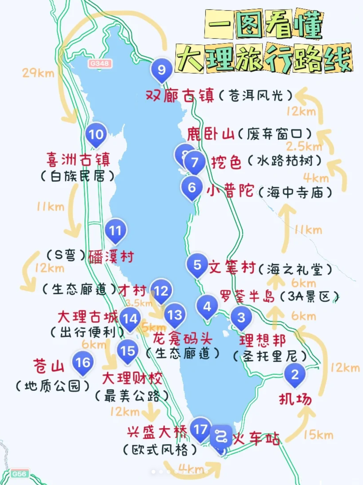
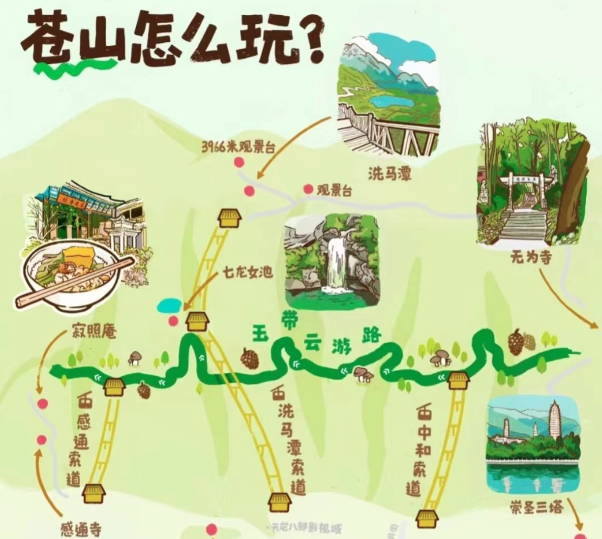

# 大理攻略

失业后，我终于来到心心念念的大理，现在奉上我的部分攻略，同时分享我在这里的各种见闻。

大理的旅行大部分是沿着洱海展开的，环线150公里，下面是景点的大致方位。洱海分为海西区和海东区。当然还有其他一些古镇和景点在后面介绍。

出行：
大家可以根据自己的情况选择环游方式。

主要方式分为以下几种：    

- 环洱海旅游观光巴士：通过“安心游大理小程序”购买。可以直接买三天的票，三天内可以无限次上下车，车会在各个景点设置站点。也可以根据自己的行程单独选择一次性的区间车票。但每次上车前需要遵照车的时间进行预约。
- 自驾：可以租车，但是大部分景点都不允许车进入，需要停靠。 
- 包车：如果多人的话，可以包车。跟司机商议，如何停留，停留多久。按天算钱。
- 自行：像我一样主打自由随意的人，可以根据不同景点自行选择出行方式。本人住在古城附近，两公里内的都是步行，两公里到十公里的打车或者租电动车，超过十公里的选择公共交通。（租电动车也要货比三家，正常是每天40，如果不足一天可以讲价）

住宿：
  个人建议住在古城附近，理由有三：
  - 机场和火车站都有直达古城的大巴
  - 距离几个最主要的景点比较近
  - 距离公共车站近

接下来我按照个人的经历介绍下各个景点

## 洱海生态廊道
洱海生态廊道属于海西路段，起点下关阳南溪，终点桃源码头，有46公里。海西开车的路在城市和村庄中间，路不沿着洱海边，开车看不到洱海。生态廊道个人的摩托车、电动车、自行车都不能进入，里面有共享单车，四轮车，观光车。另外如果自己骑电动车，警惕那些要求你停车收费的店家，其实找个空闲的地方免费就可以。下面是我去过的几个沿途景点，大家可以根据个人情况选择。

### 龙龛码头
这是我第一次见到洱海，景色美好，随手一拍就是碧水蓝天的大片。冬天可看到海鸥，早上在这里看日出，每天可查询日出时间。会有很多街边歌手在海边唱歌，大家可以花20块钱点歌，对自己歌技自信或者想留下特殊纪念的也可以选择用他们的设备唱歌。

### 才村码头
各个方面都与龙龛码头很相似。我是早上八点前去看日出，到了发现，码头的部分是被拦截的。但是去了很多人，大家都选择跨过栏杆，去了观看日出的最佳方位。我也非常羞耻的选择了从众。如果大家需要看日出，还是推荐龙龛码头。

### 廊桥
景致并不比码头好看，大家根据自己情况前往。廊桥有很多不同弧度不同半径的桥洞。喜欢拍照的可以选择这个地方。

### S湾
个人觉得洱海附近的景点大同小异，这个景点倒也不必一定去

## 海东环线
个人非常推荐自驾在海东环线，而且非常建议下午，因为可以看到日落。
路过的景点可以介绍下：
### 圣托里尼
一个非常热门的打卡点，全部是仿希腊的建筑，白墙蓝瓦。如果你喜欢拍照，这里有一些地方可以拍出假装在国外的大片。但是这一地带，商业性非常明显。绝佳的机位都被咖啡店或酒店私有化，需要消费。而且价位普遍比其他地方高很多。当然，人民币玩家可以忽略这些问题。对于这个地方，网上评价褒贬不一，大家可以根据个人喜好选择是否前往。

### 文笔村
被称为“大理小镰仓”，可以作为环游的一站休息地。有一些网红拍照点，比如彩虹公路（实际的颜色不太明显）、彩色墩子、彩虹色护栏等等。

### 小普陀
位于洱海里的袖珍岛，上岛需要花钱坐船，岛上一个小寺庙。很多人不推荐上岛，所以我们也没去。

当然这条路还有其他景点，依照个人的环行经验，也不必执着于这些景点，因为这条线很多路途紧挨洱海，可以根据实际感受，随走随停。路旁也有很多咖啡店，可以提供很好的视野。

## 苍山

如图所示，从下往上看总共有三条索道：
- 洗马潭索道
七龙女池景区及洗马潭景区连成一体，乘坐索道可全面领略到杜鹃林、冷杉林等最具神秘感和诱惑力的苍山极顶风光，三条索道唯一能直接登顶苍山的索道，往返票价310/人
- 中和索道
索道下站位于大理古城三月街赛马场西，上站至中和寺，可谓“道头观一寺”，最特别的吊篮悬挂式敞篷小缆车，往返票100/人
- 感通索道
海拔在2260~2550米之间，索道上站处可徒步到达珍珑棋局、清碧溪三潭及苍山大峡谷等景点，往返票价100/人

如果不是从洗马潭索道出发，想登顶苍山也可以在当前索道结束后，通过徒步的方式去到七龙女池。3966观景台也是一个重要网红打卡点。注意：上面真的很冷很冷，一定要记得穿羽绒服，羽绒裤。如果担心有高反，景区入口卖氧气瓶，记得讲价，不超过10元。下山的时候，可以根据个人情况，选择是否去苍山周边一些景区。

### 苍山周边
1.寂照庵得名与“感而遂通，寂静照鉴”被称为最美尼姑庵，只请花不烧香，将禅意与美学完美融合

2.感通寺又名荡山寺，奔走的徐霞客、乱世担当禅师以及坎坷的林则徐曾在这里共饮一杯感通茶

3.天龙八部影视城(门票38起/人) 这是金庸笔下的大理国，带你走进武侠，圆一个武侠梦

## 心邸咖啡馆
咖啡馆的设计很有创意，各个窗户都能构建成一个相框的形状，下午的时候，能把彩霞与天空镶嵌其中。喜欢拍照的一点不要错过，真的很出片。

------------------
下面是几个关于古城的介绍：

## 大理古城
大理总共有好几个古城，其中最出名的就是大理古城。其实我真实的感受是，非常商业化，与其他城市的古城差异不大。晚上比较有趣，路边很多算卦、疗愈、甚至卖个人诗集、小说等作品的摊位，还有一些酒吧营业。北门是菜市场，有着浓浓的烟火气，很多本地人也在这里买菜，如果长期旅居可以考虑在这边买各种生活用品。说一下我去的几个有特点的地方：
### 酒吧
#### 大冰的小屋
慕名而去，但是场地非常低调，以至于我开始没找到。跟普通酒吧的模式完全不同，外面无法感知到里面的任何光线与声音。门口坐着人员，需要扫码消费后才能进入，给人感觉略不友好。歌手的唱功一般，没有惊艳到我。
#### 秘境
我是完全因为歌手的声音被吸引去的。跟普通的酒吧差距很大，像是在一个胡同里，外部装饰非常简约，黑白相间却很有日系的设计感，房间里铺满石子。我听了两个歌手，都唱功不俗，很有故事感。
#### 妖三三LIVE
《去有风的地方》里刘亦菲去过的酒吧，我被旅游搭子安利，陪同前往。两个弹吉他的歌手和一个女鼓手，全程弹唱（别的酒吧基本都是一个歌手一小时）。歌手说自己原来唱地下摇滚的，后来唱的越来越流行，可能是生活所迫吧。他们唱了几首南京李先生的歌，音色不错，个人很喜欢。

### 特色饮食
#### 非凡油条
可以直接导航，做法很独特。把传统的油条和目前网红糕点结合起来，并且他家豆浆可以无限续杯，营销模式都很现代！

#### 巍山𤆵肉饵丝
在古城北门菜市场附近。这是我第一次吃饵丝，汤汁味道很浓郁，价钱过于良心，我没吃完一碗，9块钱！

大理古城十一点多有一些小酒摊，形形色色的人在那里侃大山，很多人都是走南闯北甚至全球旅行的人，他们带来的见闻与故事都很有趣，如果有兴趣的话可以找找。

## 喜洲古镇
喜洲古镇相对商业性不太明显，很多建筑是非常本土的白族设计。而且保留了大量的比较古老的房子，满满的历史感。街边好多本地老年人摆摊。其实喜洲对外的古镇并不大，我关掉导航在村里各种游荡，见到了很多当地人居住的破旧土房子，也走进无数个死胡同。不过如果大家时间紧张可以参考下面的攻略。我还在当地嬢嬢的劝说下，花20块钱编了26个彩色小辫。
### 坐车
- 出发：大理古镇苍山门左边的停车场，也是三月街的对面
- 回来：喜洲古镇正义门很多回大理古镇的大巴
- 价格：去8元，回10元

### 旅行路线
食花记->马英豌豆粉->转角楼->麦田->扎染->300年古树
- 食花记现烤现吃的鲜花饼，味道不错
- 马英豌豆粉酸酸甜甜，入口清凉。不是很符合我的口味，但是应该有人会喜欢
- 转角楼是一个网红打卡地，一个非常古朴的建筑
- 网红地麦田，季节好的话，会看到大片的麦浪，以及远处的苍山白云。可以在旁边的咖啡店，坐着发呆。视野很宽阔
- 喜洲这里很多扎染，后面单独说
- 这个300古树是《去有风的地方》刘亦菲落泪的地方，导航“禾田里精品民宿”，这棵古树确实壮观，让我产生了爬树的冲动

有攻略也推荐了**严家大院**，有兴趣的可以前往。喜洲附近有**海舌公园**，但是需要在“海舌半岛”小程序上前一天下午六点预约。

### 扎染
扎染属于国家级非物质文化遗产。而目前最著名的扎染据说就在喜洲。所以喜洲古镇里有很多的扎染的体验店。一般可选择的扎染物品包括：连衣裙、T恤衫、包、桌布、围巾、帽子等。一般是白色底色，个人选择一些图案染到选择的物品上，不同的图案会是不同的扎染方式和耗时。大家可以货比三家，根据个人兴趣选择店铺，体验扎染的全流程。

## 双廊古镇
这个地方距离大理古城比较远，于是我通过“安心游大理小程序”购买了到该景点的往返票。这个古镇其实有很成熟的商业，如果说有什么特色的话就是这个古镇与洱海相接，所以很多景点可以看到洱海。我下面提两个古镇比较大的小景点：
### 南诏风情岛
该岛四面环水。上岛需要50块钱门票，有大船拉你去。岛上是不同的风景，也有一些人工网红景点，一个小时基本就能逛完。大家可根据自己的时间前往。

### 太阳宫
是具有绝佳艺术性的杨丽萍艺术空间，斥资千万打造的洱畔宫殿。太阳宫参观分为上午和下午两个时段，上午9：00-12：00为免费参观时段，参观时间为半小时，有专人带领和讲解，共有6个时段，每个时段预约20人，只要提前一天在微信号“太阳宫艺术空间”的“预约服务”预约，注意是前一天的中午12点开始预约哦，不用提前填好信息进入预约页面，到时间了填信息再进入就行，否则会卡死，一般定好闹钟还是能约上的～下午的话就要购买128/人的下午茶才能进去哦，时间不限。

## 沙溪古镇
沙溪古镇是一个被《有风的地方》带火的景点，是一个保存完好的古代白族古镇。相较于其他古镇，这个古镇的商业化就很不明显了。这个古镇距离大理市区大概一百多公里，推荐大家拼车或自驾。而且它距离丽江是一个小时的路程，如果需要去丽江的话，可以作为中间景区。下面是沙溪古镇的几个小景点：
### 薄荷咖啡
《去有风的地方》的咖啡馆，可以打卡拍照
### 古戏台
沙溪古镇的中心，拥有千年历史
### 玉津桥
许红豆走过的小桥，伴着远处的苍山白云
### 先锋书店
书店一侧是咖啡馆，另一侧是算是观景台，有李现的同款机位
### 半山咖啡馆
可以在咖啡馆俯瞰古镇和麦田的景色，享受宁静时光

## 崇圣寺
是金庸武侠小说中“天龙寺”的原型。历史上有9位大理皇帝在此出家，其中包括段誉的原型--段正严。

崇圣寺三塔的历史可以追溯到1301年，当时是大理国的皇宫，也是大理国皇帝的居住地。而后，在明代中期，这里被改建为寺庙。寺内主要有三座塔楼，分别是南塔、中塔和北塔。南塔高达69.13米，是云南省现存的木塔，中塔则以砖木结构和宝顶风格著称，北塔则以独特的八角形塔身和琉璃瓦覆盖而出名。
这三座塔楼矗立在崇圣寺内，相互辉映，形成了独特的建筑景观。我还在该寺第一次体验了斋饭，20元一位。

## 最后
大理真的是一个适合疗愈的城市，适合淡季的长假在这里沉浸式感受。在我的旅居过程中，不仅看到了美好的自然风光，也认识了很多有趣的灵魂。如果有机会，我会把这些故事写出来，跟大家分享。
